# Prostor Agent — Архитектура

> 📌 Этот документ — высокоуровневый обзор для контрибьюторов.
> Детали — в коде (см. ссылки на файлы) и в [AGENTS.md](AGENTS.md).

---

## 📊 Dependency Graph (взаимосвязи модулей)

```mermaid
graph TB
    subgraph "Layer 1 — Core (план: prostor_core/)"
        config["prostor_cli/config.py<br/>6997 LOC — конфигурация"]
        auth["prostor_cli/auth.py<br/>8323 LOC — авторизация"]
        models["prostor_cli/models.py<br/>4095 LOC — модели"]
    end

    subgraph "Layer 2 — Agent Core"
        conv["agent/conversation_loop.py<br/>4561 LOC — главный цикл"]
        aux["agent/auxiliary_client.py<br/>6082 LOC — LLM клиент"]
        adapters["agent/transports/<br/>anthropic, bedrock, openai"]
        curator["agent/curator.py<br/>1916 LOC — skill curator"]
        prompt["agent/prompt_builder.py<br/>1798 LOC"]
    end

    subgraph "Layer 3 — Tools (10 оптимизаций)"
        hashline["tools/hashline.py<br/>31 KB — O(1) matching"]
        batch["tools/batch_patch_tool.py<br/>14.7 KB — 1 LLM round-trip"]
        mcp["tools/mcp_tool.py<br/>4716 LOC — MCP protocol"]
        browser["tools/browser_tool.py<br/>3891 LOC — Playwright"]
        delegate["tools/delegate_tool.py<br/>3151 LOC — субагенты"]
    end

    subgraph "Layer 4 — Gateway (16+ платформ)"
        runner["gateway/run.py<br/>17561 LOC ← GOD-FILE"]
        platforms["gateway/platforms/<br/>telegram, discord, slack,<br/>whatsapp, signal, matrix,<br/>feishu, qqbot, yuanbao, ..."]
    end

    subgraph "Layer 5 — CLI + UI"
        main["prostor_cli/main.py<br/>12649 LOC ← GOD-FILE"]
        webserver["prostor_cli/web_server.py<br/>12901 LOC, 62 класса"]
        gateway_cli["prostor_cli/gateway.py<br/>6415 LOC"]
        cli_legacy["cli.py<br/>14874 LOC ← LEGACY"]
    end

    subgraph "Layer 6 — Plugins (18 плагинов)"
        plugins["plugins/platforms/<br/>+ memory, kanban, spotify, ..."]
    end

    subgraph "Layer 7 — Desktop + TUI"
        desktop["apps/desktop/<br/>Electron 40 + React"]
        tui["ui-tui/<br/>TypeScript TUI"]
    end

    subgraph "Layer 8 — State"
        state["prostor_state.py<br/>5017 LOC — persistent state"]
        run_agent["run_agent.py<br/>5550 LOC — entry point"]
    end

    %% Dependency arrows (красные = циклические)
    main -->|"uses"| config
    main -->|uses| auth
    main -->|uses| gateway_cli
    main -->|uses| webserver

    conv -->|uses| aux
    conv -->|uses| adapters
    conv -->|uses| prompt
    conv -->|uses| curator

    aux -->|uses| config
    adapters -->|uses| auth

    hashline -->|uses| config
    batch -->|uses| config
    mcp -->|uses| config
    browser -->|uses| config

    runner -->|uses| conv
    runner -->|uses| platforms
    runner -->|uses| state

    plugins -->|uses| config
    plugins -->|uses| state

    desktop -->|uses| webserver
    tui -->|uses| gateway_cli

    %% ЦИКЛИЧЕСКИЕ ЗАВИСИМОСТИ (красные пунктирные)
    aux -.->|⚠️ CYCLE| main
    curator -.->|⚠️ CYCLE| auth
    hashline -.->|⚠️ CYCLE| main
    mcp -.->|⚠️ CYCLE| main
    main -.->|⚠️ CYCLE| runner

    classDef godfile fill:#ff6b6b,stroke:#c92a2a,stroke-width:3px
    classDef core fill:#74c0fc,stroke:#1971c2
    classDef cycle stroke:#e03131,stroke-dasharray:5 5

    class runner,main,webserver,cli_legacy godfile
    class config,auth,models core
```



### 🔴 Циклические зависимости (4 пары, Issue #25)

| Цикл | Импортов | Проблема |
|---|---|---|
| `agent → prostor_cli` | 134 | Ядро зависит от CLI |
| `tools → prostor_cli` | 97 | Инструменты зависят от CLI |
| `prostor_cli → gateway` | 96 | CLI зависит от gateway |
| `prostor_cli → agent` | 170 | CLI зависит от ядра (нормально, но создаёт цикл) |

**Решение:** вынести `config.py`, `auth.py`, `models.py` в `prostor_core/` (см. Issue #25).

### 🔴 God-файлы (5 файлов >10K строк)

| Файл | Строк | Issue |
|---|---|---|
| `gateway/run.py` | 17,561 | #23 |
| `cli.py` | 14,874 | #22 |
| `prostor_cli/web_server.py` | 12,901 | #24 |
| `prostor_cli/main.py` | 12,649 | — |
| `tui_gateway/server.py` | 10,958 | — |

---

## 🏛️ Два архитектурных принципа

Проstor вырос из Hermes Agent, и в коде сохранились **два неизменных принципа**,
определяющие почти каждое решение:

### 1. Per-conversation prompt caching неприкосновенен

Долгоживущий разговор повторно использует кэшированный префикс каждый ход.
**Всё, что мутирует прошлый контекст, меняет toolset или пересобирает system
prompt mid-conversation, инвалидирует кэш и умножает стоимость для пользователя.**

→ Единственное исключение — сжатие контекста (`tools/context_optimizer.py`).

### 2. Ядро — узкая талия; возможности живут на краях

Каждый **model tool** добавляется на каждый API-вызов. Планка для нового
*core* tool высокая. Большинство новых возможностей должно приходить как:

```
CLI-команда + skill  →  service-gated tool  →  плагин  →  MCP server  →  новый core tool
```

Расширяемся **на краях**, консервативны **в талии**.

---

## 📦 Компоненты

```
┌──────────────────────────────────────────────────────────────────┐
│                         Prostor Agent                            │
│                                                                  │
│  ┌────────────┐  ┌──────────────┐  ┌──────────────────────────┐ │
│  │   CLI      │  │   TUI        │  │   Desktop (Electron)     │ │
│  │ (cli.py)   │  │ (ui-tui/)    │  │   (apps/desktop)         │ │
│  └────────────┘  └──────────────┘  └──────────────────────────┘ │
│         ↓                ↓                      ↓                │
│  ┌────────────────────────────────────────────────────────────┐ │
│  │                    run_agent.py (agent core)               │ │
│  │                                                            │ │
│  │  • prompt construction  • tool dispatch                    │ │
│  │  • per-conversation state  • trajectory compression        │ │
│  │  • self-improvement loop (memory + skills + curator)        │ │
│  └────────────────────────────────────────────────────────────┘ │
│         ↓                                                        │
│  ┌──────────────┐  ┌───────────────┐  ┌──────────────────────┐ │
│  │ Model Layer  │  │ Tools Layer   │  │ Memory Layer         │ │
│  │ (providers/) │  │ (tools/)      │  │ (memory/, session_*) │ │
│  └──────────────┘  └───────────────┘  └──────────────────────┘ │
│         ↓                                                        │
│  ┌─────────────────────────────────────────────────────────────┐│
│  │              Gateway (Telegram, Discord, Slack, …)          ││
│  │              (gateway/)  — unified transport               ││
│  └─────────────────────────────────────────────────────────────┘│
└──────────────────────────────────────────────────────────────────┘
```

---

## 🔧 Ядро: `run_agent.py`

`run_agent.py` (после рефактора v0.15.0: 16k → 3.8k LOC) — основной оркестратор.
Принимает входящие сообщения из CLI / TUI / Desktop / Gateway, строит prompt,
диспатчит tool calls, поддерживает per-conversation state.

Ключевые модули вокруг ядра:

| Модуль | Назначение |
|---|---|
| `agent/prompt.py` | Сборка system prompt (cache-stable) |
| `agent/tool_dispatch_helpers.py` | Параллелизация tool calls |
| `agent/i18n.py` | Русский/английский UI |
| `trajectory_compressor.py` | Сжатие истории разговора |

---

## 🛠 Tools Layer: `tools/`

Все **core model tools** живут в `tools/`. Каждый из них уходит в каждый
API-вызов → требования к core tools высокие.

### ⚡ Performance tools (v0.17.0 — новые)

| Tool | Назначение | Метрика |
|---|---|---|
| `hashline.py` | O(1) hash matching для patch | **4700x** быстрее |
| `hashline_persistent_cache.py` | Кэш индекса на диск | **7x** на повторных patch |
| `batch_patch_tool.py` | Множественные patch за 1 round-trip | 1 → N |
| `batch_read_tool.py` | Множественные read за 1 round-trip | 1 → N |
| `result_compression.py` | Сжатие tool results | **99.6%** меньше токенов |
| `token_budget.py` | Трекинг потребления токенов | warn at 75/90/95% |
| `context_optimizer.py` | Прогрессивное сжатие контекста | **99.7%** контекста |
| `smart_read_cache.py` | Кэш read_file с mtime+size | — |
| `adaptive_router.py` | Детекция паттернов → batch | auto-suggest |

### 🔌 Functional tools

| Tool | Назначение |
|---|---|
| `delegate_tool.py` | Spawn subagent'ов |
| `browser_tool.py` | Browser automation |
| `cronjob_tools.py` | Cron-расписание |
| `memory_tool.py` | Чтение/запись memory |
| `skills_tool.py` | Skills manager |
| `todo_tool.py` | TODO lists |
| `clarify_tool.py` | Уточняющие вопросы к юзеру |
| `image_generation_tool.py` | ComfyUI / FAL / Krea |
| `video_generation_tool.py` | Видео generation |

---

## 🌐 Gateway: `gateway/`

Универсальный transport для **20+ мессенджер-платформ**.
Один и тот же `run_agent.py` обрабатывает сообщения из:

- Telegram
- Discord
- Slack
- WhatsApp
- Signal
- Matrix
- Feishu / Lark
- WeCom
- LINE
- SimpleX
- iMessage (через Photon)
- и др.

Все каналы приводятся к **единому формату** `IncomingMessage` →
`run_agent.py` → `OutgoingMessage` → обратно в канал.

---

## 🧠 Self-Learning Loop

Prostor — единственный агент со **встроенным циклом обучения**:

```
   ┌──────────────────────────────────────────────────────┐
   │              Self-Improvement Loop                   │
   │                                                      │
   │  1. Сессия: пользователь решает задачу               │
   │           ↓                                          │
   │  2. После успеха: авто-создание / улучшение skill    │
   │           ↓                                          │
   │  3. Skill сохраняется в Skills Hub (.prostor/skills/)│
   │           ↓                                          │
   │  4. Память (memories/) обогащается фактами           │
   │           ↓                                          │
   │  5. Следующая сессия: skill уже есть, память есть    │
   │           ↓                                          │
   │  6. Curator (background) периодически                │
   │     улучшает skills, чистит memories                 │
   └──────────────────────────────────────────────────────┘
```

### Компоненты:

- **`memory_tool.py`** — запись/чтение memories
- **`session_search`** — FTS5-поиск по прошлым сессиям с LLM-саммаризацией
- **`skills_tool.py`** — Skills Hub (CRUD + auto-create)
- **`trajectory_compressor.py`** — сжатие trajectory → memory candidates
- **`honcho`** (опционально) — диалектическое моделирование пользователя

---

## 📦 Plugins & Skills

Расширения живут **за пределами ядра**:

| Зона | Где | Как расширять |
|---|---|---|
| **Skills** | `skills/` + `optional-skills/` | YAML + SKILL.md |
| **MCP servers** | `mcp_serve.py` + каталог | Внешние процессы |
| **Provider adapters** | `providers/` (anthropic, openrouter, …) | Pluggable |
| **Platform adapters** | `gateway/` (telegram, discord, …) | Pluggable |
| **Custom plugins** | `plugins/` | ABCs + hooks |

Плагины **никогда не трогают core** — только через публичный surface.

---

## 🐳 Deployment

```
┌────────────────────────────────────────────────────────┐
│                 Deployment modes                       │
│                                                        │
│  ┌──────────────┐  ┌──────────────┐  ┌──────────────┐ │
│  │   CLI local  │  │  TUI local   │  │  Desktop     │ │
│  │  (prostor)   │  │  (prostor)   │  │  (Windows)   │ │
│  └──────────────┘  └──────────────┘  └──────────────┘ │
│                                                        │
│  ┌──────────────┐  ┌──────────────┐  ┌──────────────┐ │
│  │  VPS / Docker│  │  Gateway     │  │  Serverless  │ │
│  │  (Dockerfile)│  │ (multi-chan) │  │              │ │
│  └──────────────┘  └──────────────┘  └──────────────┘ │
└────────────────────────────────────────────────────────┘
```

### Потоки данных:

1. **Локальный CLI/TUI/Desktop**: прямая работа с `run_agent.py`
2. **VPS / Docker**: тот же `prostor` binary в контейнере + опционально gateway
3. **Gateway mode**: единый процесс обслуживает несколько мессенджеров
4. **Serverless**: cold-start через `prostor_bootstrap.py` (cold-start perf optimizations)

---

## 🔒 Trust Model

Подробно — в [SECURITY.md](SECURITY.md). Кратко:

**Единственная граница доверия**: между **данными пользователя** и **инструкциями
от модели**. Всё, что LLM возвращает, считается **ненадёжным** до тех пор, пока
не проверено:

- Tool calls парсятся через AST, не eval
- Файловые пути нормализуются и проверяются
- Секреты никогда не покидают процесс
- MCP-серверам передаётся минимально необходимое

Вне этой границы — heuristics (defensive, **никогда не load-bearing**).

---

## 📚 Дополнительная документация

- [README.md](README.md) — основное
- [AGENTS.md](AGENTS.md) — для AI-ассистентов и разработчиков
- [CONTRIBUTING.md](CONTRIBUTING.md) — как контрибьютить
- [SECURITY.md](SECURITY.md) — security policy
- [CHANGELOG.md](CHANGELOG.md) — история версий
- [website/](website/) — Docusaurus docs (после починки deploy)
- [skills/](skills/) — каталог skills

---

**Версия документа**: v0.17.0 (2026-06-21)
**Поддерживается**: командой Prostor / Nous Research
